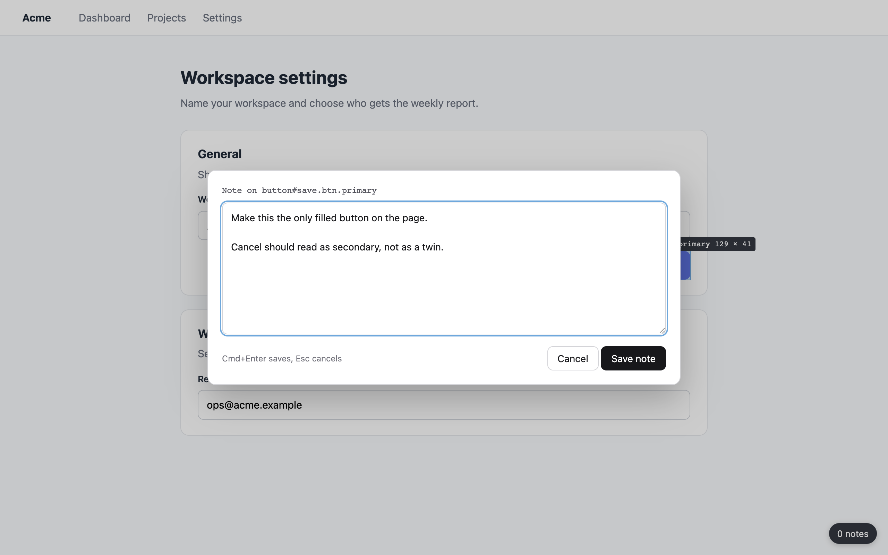
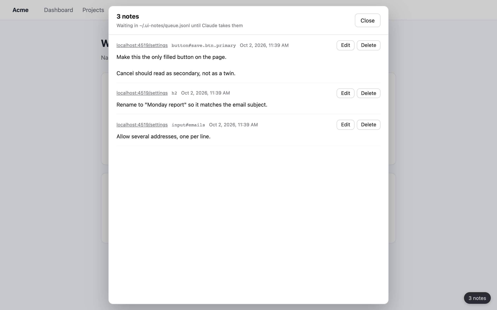

# UI notes for Claude Code

Leave notes on your running app, then let Claude Code work through them in one go.

Hold Option on any page served from localhost, click the element you mean, and write what should change. Each note is saved with the page URL, the element's selector and HTML, and in React dev builds the component names and the file and line that rendered it. When you're done, tell Claude Code "done with my notes". It takes the whole batch, finds the code behind each element and reports back per note.



A pill in the bottom right corner counts the notes waiting. Click it to read, edit or delete them.



## What it runs on

- **Google Chrome on macOS.** The setup script registers the native host where Chrome on macOS looks for it.
- **Pages on `localhost` and `127.0.0.1`**, any port. No other site gets the script.
- **[Bun](https://bun.sh)**, which runs the small native host that writes the notes file. A Chrome extension cannot write files by itself.
- **Claude Code**, through the bundled skill. The notes are plain JSON lines, so any agent that can read a file can use them too.

## Setup

1. Clone the repo where it can stay. Chrome identifies an unpacked extension by its folder path, so if you move the folder later, run step 2 again and reload the extension.

   ```sh
   git clone https://github.com/simonorzel26/ui-notes-for-claude-code.git ~/ui-notes-for-claude-code
   cd ~/ui-notes-for-claude-code
   ```

2. Register the native host:

   ```sh
   bun setup.ts
   ```

   This writes two files into `~/Library/Application Support/Google/Chrome/NativeMessagingHosts/`: `ui_notes_for_claude_code.json`, which tells Chrome which extension may start the host, and `ui_notes_for_claude_code.sh`, which starts `host.ts` with your Bun.

3. Load the extension. Open `chrome://extensions`, turn on **Developer mode** (top right), click **Load unpacked** and choose the `extension` folder inside the repo. In the file dialog, Cmd+Shift+G lets you paste a path. Tabs that are already open get the script straight away.

4. Give Claude Code the skill:

   ```sh
   mkdir -p ~/.claude/skills && ln -s "$PWD/skill" ~/.claude/skills/ui-notes
   ```

5. Open any localhost page. If the bottom right corner says **0 notes**, it works.

## Use

- **Hold Option.** The element under the pointer is highlighted with its tag, classes and size, like Chrome's element picker.
- **Option-click it.** The click never reaches the page, so buttons don't fire and links don't open. Write the note; paragraphs are fine. Cmd+Enter saves, Esc cancels.
- **Click the pill** to see every waiting note, as tall as the window. Edit changes a note in place (Cmd+Enter saves, Esc leaves the edit). Delete asks for a second click. The link opens the page the note was left on.
- **Tell Claude Code "done with my notes".** The skill first moves `~/.ui-notes/queue.jsonl` to `~/.ui-notes/batches/<timestamp>.jsonl`, so anything you add while Claude works starts a new queue. Then it makes the changes and reports per note. The pill drops back to 0 the next time you switch to the window.

## What a note holds

One JSON object per line in `~/.ui-notes/queue.jsonl`:

| Field | Content |
| --- | --- |
| `text` | What you wrote |
| `id`, `at` | A UUID and the time it was saved |
| `url`, `heading`, `viewport` | The full URL, the page's `h1`, the window size |
| `name`, `selector` | The element as the highlight labels it, and a CSS path to it |
| `innerText`, `element`, `parent` | The element's text and its HTML and its parent's, truncated |
| `components`, `source` | React dev builds only: the nearest component names, and the stack frames where the element's JSX was written |

Your notes stay on your machine. The extension makes no network requests, and the host writes only to `~/.ui-notes`.

## How it works

- `extension/content.js` runs on localhost pages. It draws the highlight, the note modal, the pill and the list, each inside a closed shadow root so the app's CSS can't restyle them and the app's scripts can't read them.
- `extension/react.js` runs in the page's own JavaScript world, where React keeps the dev info (`__reactFiber$…`, `_debugStack`) that content scripts can't see.
- `extension/background.js` passes each request on to the native host, because content scripts cannot talk to one.
- `host.ts` is the native messaging host. Chrome starts it once per request; it adds, lists, edits or deletes notes and replies with the whole queue, so the count and the list always match the file. One more copy runs while Chrome is open and watches `extension/`: edit a file there and the extension reloads itself and re-injects into open localhost tabs.

## Troubleshooting

When something fails, the pill turns red and shows Chrome's error.

- **Specified native messaging host not found.** Setup hasn't run. Run `bun setup.ts`.
- **Access to the specified native messaging host is forbidden.** The loaded folder isn't the one setup registered, usually because the repo moved. Run `bun setup.ts` from the folder you loaded, then click reload on the extension in `chrome://extensions`.
- **Any other host error after updating or moving Bun.** The launcher holds Bun's full path. Run `bun setup.ts` again.

## Uninstall

Remove the extension in `chrome://extensions`, then:

```sh
rm ~/Library/Application\ Support/Google/Chrome/NativeMessagingHosts/ui_notes_for_claude_code.{json,sh}
rm ~/.claude/skills/ui-notes
```

Your notes stay in `~/.ui-notes` until you delete that folder.

## License

MIT
